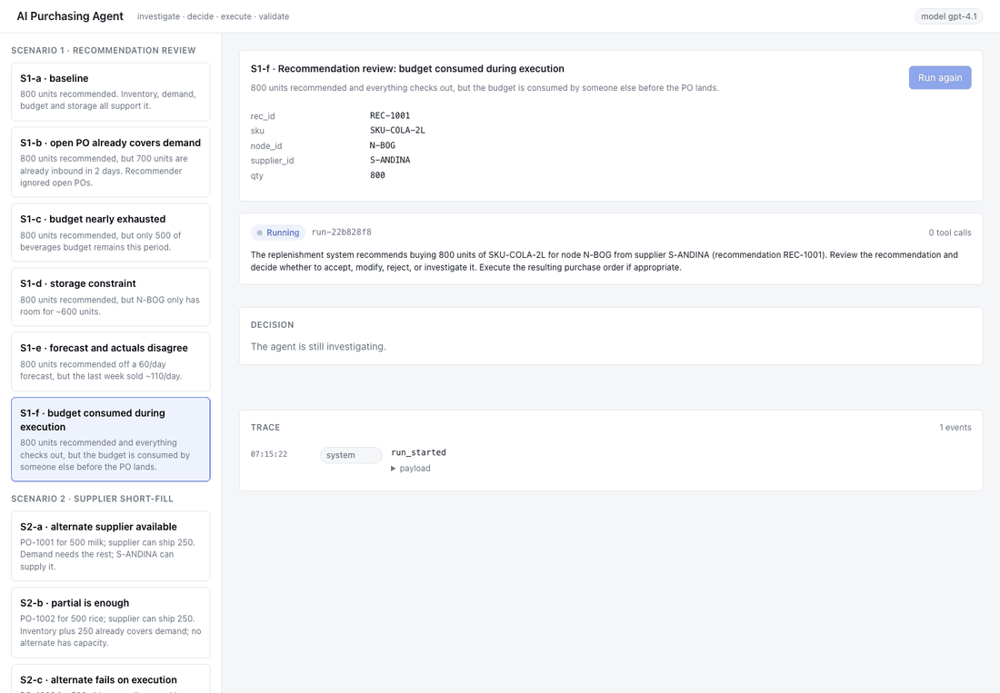

# AI Purchasing Agent

An agent that assists a quick-commerce buyer. It takes a purchasing situation, investigates the relevant data
through tools, decides (accept / modify / reject / investigate / escalate), executes the decision against a
mock ERP, and **validates the outcome**, recovering or escalating when reality disagrees with the plan.

The goal is not a chatbot that answers purchasing questions. It is a system that makes, executes and
validates purchasing decisions, with a human in the loop where it matters.

- **Scenario 1 (recommendation review)** is implemented end to end with six fixtures.
- **Scenario 2 (supplier cannot fulfil)** is implemented end to end with three fixtures, on the same tools.
- Feedback loop and evaluation are the focus: the ERP is allowed to disagree with the agent, and the evals
  check what the agent did, not just what it said.

## Quick start

Prerequisites: Python 3.10+, [uv](https://docs.astral.sh/uv/), Node 20+.

```bash
cp .env.example backend/.env      # add OPENAI_API_KEY, or set LLM_PROVIDER=scripted for a no-key demo
make setup                        # uv sync + npm install
make dev                          # API on http://localhost:8000, UI on http://localhost:5173
```

Other targets:

```bash
make test                         # 50 pytest cases, no network (policy, ERP, runner, API, rubric)
make evals                        # run evals/cases.yaml against the live agent -> backend/evals/report.md
cd backend && uv run python -m evals.run_evals --provider scripted   # harness self-check, no key
cd backend && uv run python -m evals.run_evals --repeat 3            # consistency across repeats
```

API docs are at http://localhost:8000/docs once the backend is running.

## Demo



*Live gpt-4.1 run of S1-f (budget consumed during execution): investigate, first PO rejected, validation mismatch, revised decision, human approval, validated outcome.*

1. Open the UI, pick a scenario in the left rail (loading a scenario resets the mock ERP so every run is reproducible).
2. Press **Run agent**. The trace fills in live: tool calls, the proposed decision, the policy gate with every check, execution results, and the validation diff.
3. When the gate needs a human (PO value over the threshold, or a large deviation from the system recommendation), the run pauses with **Approve and execute** / **Reject**.
4. Try **S1-f** to see the feedback loop: the agent's first PO is rejected because another commitment consumed the budget between its check and its submission; the validator flags the mismatch; the agent re-investigates and proposes the maximum feasible quantity.
5. Try **S2-c** to see escalation: the alternate supplier looks viable but rejects the order on submission; with no third option the agent escalates with a summary of the buyer's choices.

With `LLM_PROVIDER=scripted` the same UI replays reference trajectories, so the whole flow can be seen without an API key.

## Approach

**The LLM investigates and proposes. Deterministic code gates, executes and verifies.**

```
situation ──► agent (read tools) ──► propose_decision ──► policy gate ──► [human approval] ──► execute ──► validate
                                                              │ hard fail                                  │ mismatch
                                                              └──────────── feedback to agent ◄────────────┘
                                                                          (bounded recovery, then escalate)
```

1. **Investigate.** The agent gets 13 read tools over the mock ERP: recommendation, product, inventory, demand (forecast and last 14 days of actuals), open POs with notice-aware expected inbound, PO detail, supplier notices, supplier profile and offer, all suppliers for a SKU, budget, storage, plus two deterministic analyses: `compute_coverage` and `check_constraints`.
2. **Propose.** The only way to finish is `propose_decision`: action, quantity, supplier, existing PO to amend, additional orders, rationale, key factors, confidence, and an **expected outcome** (PO status, total inbound after). The LLM has no write tools.
3. **Gate.** The executor derives ERP operations from the decision and runs every new order through `policy.check_constraints`. Hard failures (MOQ, pack size, budget, storage) are bounced back to the agent without touching the ERP. Approval is required when the PO value exceeds `APPROVAL_THRESHOLD` or the quantity deviates more than `MAX_DEVIATION_PCT` from the system recommendation.
4. **Execute.** The mock ERP enforces its own rules and may not comply: per-scenario faults make a supplier reject a PO, consume budget concurrently, or partially confirm.
5. **Validate.** `validator.py` re-reads the ERP and diffs it against the agent's expected outcome and the system's invariants: every action succeeded, confirmed equals ordered, budget and storage are not negative, and no coverage gap remains unless the agent explicitly accepted one.
6. **Recover or escalate.** Mismatches are fed back as a normal conversation turn with the actual state. The agent may re-investigate and revise up to `MAX_RECOVERY_TURNS` times, after which the run escalates to the buyer with a summary. The agent can also choose to escalate itself.

Everything is written to an audit log and shown in the UI trace.

See [docs/architecture.md](docs/architecture.md) for the component and lifecycle diagrams and
[docs/decisions.md](docs/decisions.md) for the trade-offs.

## Scenarios

Each scenario is the base dataset plus a variation. Expected behaviour is what the eval rubric checks.

| Id | Situation | Expected behaviour |
|---|---|---|
| S1-a | 800 units recommended; everything supports it | **accept** 800, validated |
| S1-b | 800 recommended, but 700 already inbound in 2 days (recommender ignores open POs) | **reject**, or modify down to MOQ |
| S1-c | 800 recommended, only 500 of budget left | **modify** to 400 (max feasible), approval required, gap acknowledged |
| S1-d | 800 recommended, storage fits 600 | **modify** to 600 |
| S1-e | 800 recommended off a 60/day forecast; last week sold 110/day | **investigate**: state the evidence needed before sizing |
| S1-f | 800 looks fine, but budget is consumed by someone else before the PO lands | first PO rejected → validation mismatch → **recovery** → modify to 400 |
| S2-a | PO for 500 milk; supplier can ship 250; another supplier can cover the rest | amend to 250 **and** new PO from the alternate |
| S2-b | PO for 500 rice; supplier can ship 250; inventory plus 250 already covers demand | amend to 250, **no** alternate order |
| S2-c | PO for 500 chips; supplier can ship 250; alternate rejects on submission | amend to 250, alternate fails → recovery → **escalate** |

## Validation and feedback loop

The brief asks how the system knows a resulting PO is actually acceptable and what happens when the outcome differs from what the agent expected.

- **Two independent sources of truth.** The policy engine (used by the agent, by the gate and by the validator) and the mock ERP's own write validation. If they disagree, the validator catches it.
- **Expected outcome as a contract.** The agent must state the total inbound and PO status it expects. The validator compares those to the real post-write state, alongside its own invariants.
- **Mismatch handling.** The mismatch list and actual state go back to the agent as feedback. Recovery is bounded; when the budget of turns is spent the run escalates with a summary rather than looping.
- **Human approval** is a first-class run state. The run pauses, the UI shows why, and approval or rejection resumes or ends it. Nothing is written before approval.
- **Audit log.** Every tool call, gate verdict, ERP write, ERP rejection, validation and human action is recorded with its payload (`/api/erp/audit?run_id=...`).

## Evaluation

`backend/evals/cases.yaml` holds one case per scenario. Each is scored on six dimensions that mirror the six questions in the brief:

| Dimension | What is checked |
|---|---|
| decision_correct | Final action in the accepted set; new-PO quantity in the accepted range |
| information_gathered | Required evidence tools were called **before** the first proposal |
| constraints_respected | Final budget and storage not negative; no hard-failing proposal was executed |
| action_appropriate | Expected ERP actions happened, forbidden ones did not, terminal status and final inbound / PO statuses match |
| validated | Executed actions were followed by a validation; completed runs end with a passing one |
| recovery_behaviour | Cases whose first action must fail show at least one recovery turn; runs never crash |

`run_evals.py` runs every case (optionally `--repeat N`), auto-approves where a human would, and writes `evals/report.md` with per-dimension pass rates, per-run facts, and every rationale for reading.

The rubric is itself tested (`tests/test_evals.py`): it must pass all nine reference trajectories and must **fail** a blind accept, an over-buy on top of an open PO, an unneeded alternate order, and a run that skipped recovery. `evals/report-scripted.md` is the harness self-check (9/9). `evals/report.md` is the live-model report (gpt-4.1, three repeats per case); the first live pass and what it changed are written up in [docs/decisions.md](docs/decisions.md).

Rationale quality is not scored by an LLM judge; the report shows the rationales and a number-density signal so a reviewer can judge them directly.

## Repository layout

```
backend/app/erp/        mock ERP: reads.py, writes.py (own rules + fault toggles)
backend/app/agent/      policy.py, tools.py, prompts.py, llm.py, scripted.py, runner.py, validator.py
backend/app/            config.py, db.py, seed.py, scenarios.py, models.py, main.py
backend/tests/          50 pytest cases, no network
backend/evals/          cases.yaml, run_evals.py, report-scripted.md
frontend/src/           React console
docs/                   architecture.md, decisions.md, assignment.pdf
```

## Configuration

See [.env.example](.env.example). `LLM_PROVIDER` (`openai` | `scripted`), `OPENAI_API_KEY`, `OPENAI_MODEL`, `APPROVAL_THRESHOLD`, `MAX_DEVIATION_PCT`, `MAX_RECOVERY_TURNS`, `MAX_AGENT_TURNS`, `DB_PATH`. No secrets are committed; `.env` is git-ignored.

## Tech

Python 3.10+, FastAPI, SQLite, pydantic, OpenAI Python SDK (Responses API, strict function tools), pytest. React 19, Vite, TypeScript, plain CSS. Built with AI-assisted tooling; every design decision is documented in `docs/decisions.md` and I can explain and modify any part of it.
