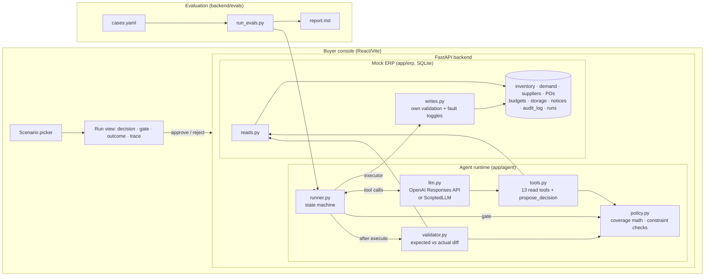
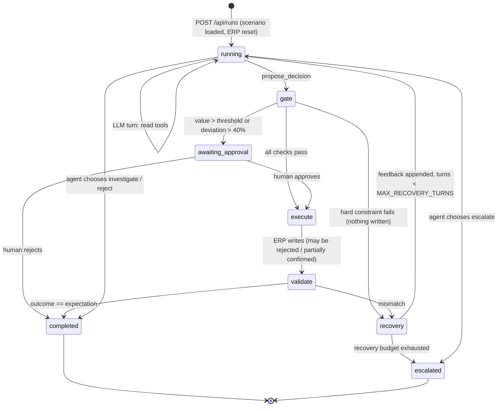

# Architecture

## One-line version

The LLM investigates and proposes. Deterministic code gates, executes and verifies. Every ERP write goes
`propose → policy.check() → approval gate → execute → validate → recover or escalate`.

## System diagram

## Run lifecycle

## Components

| Layer | File | Responsibility |
|---|---|---|
| Scenario fixtures | `backend/app/scenarios.py`, `seed.py` | Base dataset plus per-scenario variations and fault toggles. Loading a scenario resets the DB. |
| Mock ERP reads | `backend/app/erp/reads.py` | Inventory, demand (forecast + actuals), open POs with notice-aware expected inbound, suppliers, budgets, storage. |
| Mock ERP writes | `backend/app/erp/writes.py` | `create/amend/cancel_purchase_order`. Enforces MOQ, pack, budget, storage, capacity **independently of the agent**. Honours faults: `supplier:<id>:reject_new_po`, `budget:<cat>:concurrent_spend`, `supplier:<id>:confirm_ratio`. |
| Policy engine | `backend/app/agent/policy.py` | Pure functions. `compute_coverage` (net requirement over lead + review + safety days, stockout day, demand-signal flag) and `check_constraints` (hard: MOQ, pack, budget, storage; warn: capacity, over-cover, lead time vs stockout, demand signal; approval triggers; `max_feasible_qty`). |
| Tools | `backend/app/agent/tools.py` | JSON schemas (strict) and dispatch. Reads only, plus `propose_decision`. No write tool exists for the LLM. |
| Runner | `backend/app/agent/runner.py` | State machine above. Builds the write plan from the Decision, gates it, pauses for approval, executes, validates, feeds mismatches back for bounded recovery, escalates. Persists after every step. |
| Validator | `backend/app/agent/validator.py` | Compares the agent's `expected_outcome` (PO status, total inbound) and the system's own invariants (all actions ok, confirmed == ordered, budget/storage not negative, coverage gap only if accepted) against the real post-write state. |
| LLM adapters | `backend/app/agent/llm.py`, `scripted.py` | OpenAI Responses API with function tools; `ScriptedLLM` replays reference trajectories for tests and no-key demos. |
| API | `backend/app/main.py` | Runs (start in background thread, get, approve, reject), scenarios, read-only ERP inspection, audit log. |
| UI | `frontend/src` | Scenario picker, run status, decision card, gate card with per-check results and approve/reject, execution + validation, trace timeline. Polls while running. |
| Evals | `backend/evals` | `cases.yaml` rubric per scenario, `run_evals.py` harness scoring six dimensions, negative tests in `tests/test_evals.py`. |

## Why this shape

- **Separation of judgement from enforcement.** The LLM is good at weighing messy evidence and writing a rationale; it is not where MOQ arithmetic or budget checks should live. Policy math is deterministic, unit-tested and reused three times (as a tool, as the gate, in the validator), so the agent and the system agree on what "feasible" means.
- **No write tools for the model.** The Decision is data. The executor derives ERP operations from it. This makes every write auditable and makes "the agent bypassed a check" structurally impossible.
- **The ERP is allowed to disagree.** A real supplier or finance system does not care what the agent computed. Fault toggles let scenarios make execution diverge from the plan, which is what forces the validator and recovery loop to earn their keep (S1-f, S2-c).
- **Expected outcome as a contract.** Making the agent state `total_inbound_after` and `po_status` turns validation into a diff instead of a vibe check, and gives the recovery prompt something concrete to reason about.
- **Bounded recovery, then a human.** `MAX_RECOVERY_TURNS` caps how long the agent may keep trying; after that the run escalates with a summary rather than looping or silently giving up.
